Test Experiment
================

# Description

Jesse plays Crab Rave on the Meta Quest at home, but metric collection
is fixed\!

I play the same song two times. I use Oculus with a **wireless link** in
this experiment. Network set to a/n/ac at 5 GHz.

# Results

``` r
library(tidyverse)
```

    ## Warning in system("timedatectl", intern = TRUE): running command 'timedatectl'
    ## had status 1

``` r
theme_set(theme_bw())
library(knitr)
library(forcats)
library(data.table)
library(cowplot)
library(gghighlight)
library(zoo)
library(RColorBrewer)

saveplot <- function(filename, ...) {
  ggsave2(filename, ...)
  knitr::plot_crop(filename)
}
```

## Frame Rate

``` r
fps <- system('grep -Po "(?<=FPS=)[0-9]+" logcat_VrApi.log', intern = TRUE)
data <- tibble(fps) %>% mutate(fps = as.numeric(fps)) %>% mutate(ts = 0:(n()-1)) %>% select(ts, everything())
data %>%
ggplot(aes(x = ts, y=fps)) +
geom_line() +
ylim(0, NA) +
theme_half_open() + background_grid()
```

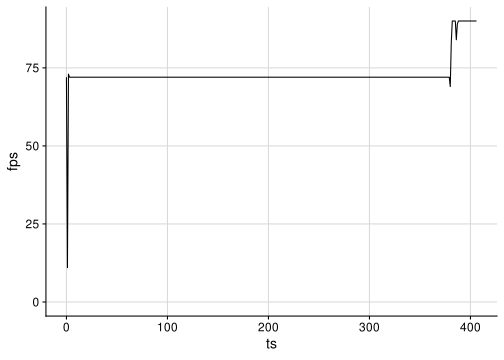<!-- -->

## Battery Levels

### Headset

``` r
if (file.exists("battery.log")) {
battery <- system('grep -Po "(?<=level: )[0-9]+" battery.log', intern = TRUE)
data <- tibble(battery) %>% mutate(battery = as.numeric(battery)) %>% mutate(ts = 0:(n()-1)) %>% select(ts, everything())
data %>%
ggplot(aes(x = ts, y=battery)) +
geom_line() +
ylim(0, NA) +
theme_half_open() + background_grid()
}
```

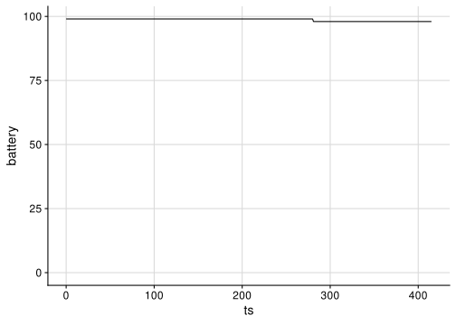<!-- -->

### Controllers

``` r
if (file.exists("OVRRemoteService.log")) {
battery <- system("grep -Po '(?<=Type:)\\s+(Left|Right),.+Battery:\\s+[0-9]+(?=%)' OVRRemoteService.log | tr -s ' ' | sed -e \'s/^[[:space:]]*//\' -e \'s/\\n[[:space:]]*//\' | cut -d' ' -f 1,5", intern=TRUE)
data <- tibble(battery) %>% separate(battery, c("hand", "level"), convert = TRUE) %>% group_by(hand) %>% mutate(ts = 0:(n()-1)) %>% select(ts, everything())
data %>%
ggplot(aes(x=ts, y=level, color=hand)) +
geom_line() +
ylim(0, NA) +
theme_half_open() + background_grid()
}
```

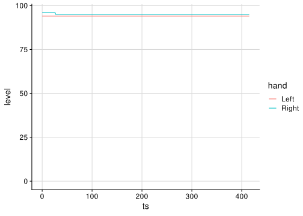<!-- -->

## CPU Usage

``` r
cpu_util <- system('grep -Po "(?<=CPU%=)[0-9]+.[0-9]+" logcat_VrApi.log', intern = TRUE)
data <- tibble(cpu_util) %>% mutate(cpu_util = 100 * as.numeric(cpu_util)) %>% mutate(ts = 0:(n()-1)) %>% select(ts, everything())
data %>%
ggplot(aes(x = ts, y=cpu_util)) +
geom_line() +
ylim(0, NA) +
theme_half_open() + background_grid()
```

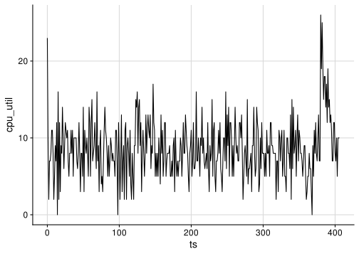<!-- -->

## GPU Usage

``` r
gpu_util <- system('grep -Po "(?<=GPU%=)[0-9]+.[0-9]+" logcat_VrApi.log', intern = TRUE)
data <- tibble(gpu_util) %>% mutate(gpu_util = 100 * as.numeric(gpu_util)) %>% mutate(ts = 0:(n()-1)) %>% select(ts, everything())
data %>%
ggplot(aes(x = ts, y=gpu_util)) +
geom_line() +
ylim(0, NA) +
theme_half_open() + background_grid()
```

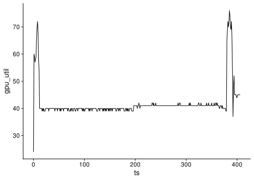<!-- -->

## Memory Usage

``` r
mem_usage <- system('grep -Po "(?<=Free=)[0-9]+" logcat_VrApi.log', intern = TRUE)
data <- tibble(mem_usage) %>% mutate(mem_usage = 12288 - as.numeric(mem_usage)) %>% mutate(ts = 0:(n()-1)) %>% select(ts, everything())
data %>%
ggplot(aes(x = ts, y=mem_usage)) +
geom_line() +
ylim(0, NA) +
theme_half_open() + background_grid()
```

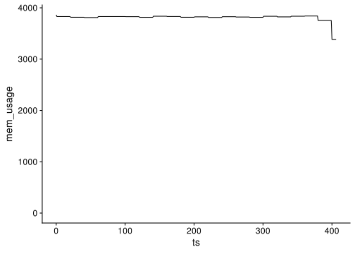<!-- -->

## Temperature

``` r
temp <- system('grep -Po "(?<=Temp=)[0-9]+" logcat_VrApi.log', intern = TRUE)
data <- tibble(temp) %>% mutate(temp = as.numeric(temp)) %>% mutate(ts = 0:(n()-1)) %>% select(ts, everything())
data %>%
ggplot(aes(x = ts, y=temp)) +
geom_line() +
ylim(0, NA) +
theme_half_open() + background_grid()
```

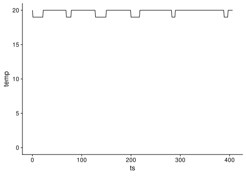<!-- -->

## Network Usage

``` r
network <- system('grep -P "\\s+wlan0\\W" net_dev.log | tr -s " " | sed -e \'s/^[[:space:]]*//\' -e \'s/\\n[[:space:]]*//\'', intern = TRUE)
data <- tibble(network) %>% separate(network, c("interface", "bytes_rx", "packets_rx", "errs_rx", "drop_rx", "fifo_rx", "frame_rx", "compressed_rx", "multicast_rx", "bytes_tx", "packets_tx", "errs_tx", "drop_tx", "fifo_tx", "colls_tx", "carrier_tx", "compressed_tx"), sep = " ", convert = TRUE) %>% mutate(ts = 0:(n()-1))
```

### Bytes Recv

<!-- Inter-|   Receive                                                |  Transmit -->

<!-- face |bytes    packets errs drop fifo frame compressed multicast|bytes    packets errs drop fifo colls carrier compressed -->

``` r
data %>%
mutate(bytes_rx = (bytes_rx - lag(bytes_rx)) / 1000) %>%
ggplot(aes(x = ts, y=bytes_rx)) +
geom_line() +
ylab("KB/s") +
ylim(0, NA) +
theme_half_open() + background_grid()
```

    ## Warning: Removed 1 row(s) containing missing values (geom_path).

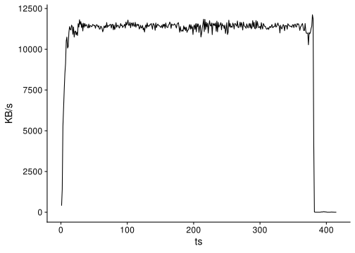<!-- -->

### Bytes Sent

``` r
data %>%
mutate(bytes_tx = (bytes_tx - lag(bytes_tx)) / 1000) %>%
ggplot(aes(x = ts, y=bytes_tx)) +
geom_line() +
ylab("KB/s") +
ylim(0, NA) +
theme_half_open() + background_grid()
```

    ## Warning: Removed 1 row(s) containing missing values (geom_path).

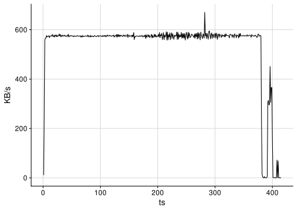<!-- -->

### Packets Recv

``` r
data %>%
mutate(packets_rx = packets_rx - lag(packets_rx)) %>%
ggplot(aes(x = ts, y=packets_rx)) +
geom_line() +
ylim(0, NA) +
theme_half_open() + background_grid()
```

    ## Warning: Removed 1 row(s) containing missing values (geom_path).

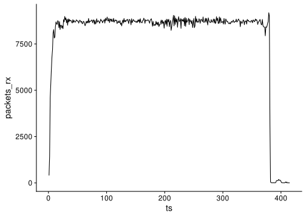<!-- -->

### Packets Sent

``` r
data %>%
mutate(packets_tx = packets_tx - lag(packets_tx)) %>%
ggplot(aes(x = ts, y=packets_tx)) +
geom_line() +
ylim(0, NA) +
theme_half_open() + background_grid()
```

    ## Warning: Removed 1 row(s) containing missing values (geom_path).

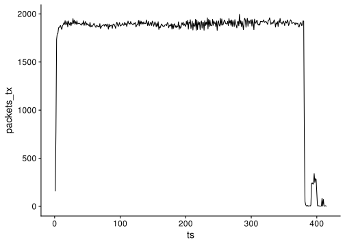<!-- -->
