Figures from “Can My WiFi Handle the Metaverse? A Performance Evaluation
Of Meta’s Flagship Virtual Reality Hardware”
================

# Article Figures

  - [Figure 1](#user-content-figure-1)
  - [Figure 4](#user-content-baseline-performance)
  - [Figure 5a](#user-content-figure-5a)
  - [Figure 5b](#user-content-figure-5b)
  - [Figure 5c](#user-content-figure-5c)
  - [Figure 5d](#user-content-figure-5d)
  - [Figure 6a](#user-content-figure-6a)
  - [Figure 6b](#user-content-figure-6b)
  - [Figure 7a](#user-content-figure-7a)
  - [Figure 7b](#user-content-figure-7b)

# All Content

## Setup

Libraries used for plotting.

``` r
library(tidyverse)
library(here)
theme_set(theme_bw())
library(knitr)
library(forcats)
library(data.table)
library(cowplot)
library(ggbreak)
library(gghighlight)
library(ggtext)
library(zoo)
library(RColorBrewer)

saveplot <- function(filename, ...) {
  ggsave2(filename, ...)
  knitr::plot_crop(filename)
}

here::i_am("plots/README.Rmd")
```

## Baseline Performance

These plots visualize data obtained from the [baseline
experiment](../experiments/headset-cable-2), in which we play a popular
game on the Meta Quest Pro under good conditions.

``` r
fps <- system(paste('grep -Po "(?<=FPS=)[0-9]+"', here("experiments", "headset-cable-2", "logcat_VrApi.log")), intern = TRUE)
data <- tibble(fps) %>%
  mutate(fps = as.numeric(fps)) %>%
  mutate(ts = 0:(n() - 1)) %>%
  select(ts, everything())
data %>%
  ggplot(aes(x = ts, y = fps)) +
  geom_line() +
  ylim(0, 90) +
  theme_half_open() +
  background_grid() +
  labs(x = "Time [s]", y = "Frames per second     ")
```

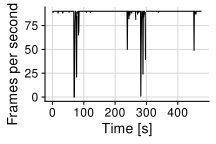<!-- -->

``` r
cpu <- system(paste('grep -Po "(?<=CPU%=)[0-9]+.[0-9]+"', here("experiments", "headset-cable-2", "logcat_VrApi.log")), intern = TRUE)
data <- tibble(cpu) %>%
  mutate(cpu = as.numeric(cpu) * 100) %>%
  mutate(ts = 0:(n() - 1)) %>%
  select(ts, everything())
data %>%
  ggplot(aes(x = ts, y = cpu)) +
  geom_line() +
  ylim(0, 50) +
  theme_half_open() +
  background_grid() +
  labs(x = "Time [s]", y = "CPU utilization     ")
```

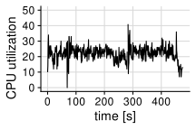<!-- -->

``` r
gpu <- system(paste('grep -Po "(?<=GPU%=)[0-9]+.[0-9]+"', here("experiments", "headset-cable-2", "logcat_VrApi.log")), intern = TRUE)
data <- tibble(gpu) %>%
  mutate(gpu = as.numeric(gpu) * 100) %>%
  mutate(ts = 0:(n() - 1)) %>%
  select(ts, everything())
data %>%
  ggplot(aes(x = ts, y = gpu)) +
  geom_line() +
  ylim(0, 100) +
  theme_half_open() +
  background_grid() +
  labs(x = "Time [s]", y = "GPU utilization     ")
```

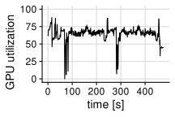<!-- -->

``` r
mem_usage <- system(paste('grep -Po "(?<=Free=)[0-9]+"', here("experiments", "headset-cable-2", "logcat_VrApi.log")), intern = TRUE)
data <- tibble(mem_usage) %>%
  mutate(mem_usage = 12288 - as.numeric(mem_usage)) %>%
  mutate(mem_usage = mem_usage / 1024) %>%
  mutate(ts = 0:(n() - 1)) %>%
  select(ts, everything())
data %>%
  ggplot(aes(x = ts, y = mem_usage)) +
  geom_line() +
  ylim(0, 11.5) +
  theme_half_open() +
  background_grid() +
  labs(x = "Time [s]", y = "Memory usage [GB]     ")
```

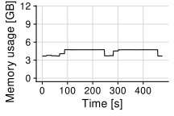<!-- -->

# Local vs Streaming

Translate filenames to human-readable names.

``` r
to_human_name <- function(name) {
  if (name == "beat-headset-wirelessadb") {
    "Local"
  } else if (name == "beat-pc-wiredadb") {
    "Wired"
  } else if (name == "beat-pc-wirelessadb") {
    "Wireless"
  } else {
    name
  }
}

experiments <- c("beat-headset-wirelessadb", "beat-pc-wiredadb", "beat-pc-wirelessadb")
```

Read measurement data into table.

``` r
data <- NULL
for (f in experiments) {
  data <- system(paste('grep -Po "(?<=level: )[0-9]+"', here("experiments", f, "battery.log")), intern = TRUE) %>%
    tibble(battery = .) %>%
    mutate(battery = as.numeric(battery)) %>%
    mutate(ts = 0:(n() - 1)) %>%
    select(ts, everything()) %>%
    mutate(config = f) %>%
    bind_rows(data, .)
}
data <- data %>%
  mutate(config = map_chr(config, to_human_name))
```

### Figure 5d

Plot the relative battery usage of the device.

``` r
colors <- RColorBrewer::brewer.pal(3, "Greens")[2:3]
tmax <- 1500
tmin <- 500
data %>%
  group_by(config) %>%
  filter(ts > tmin & ts < tmax) %>%
  mutate(ts = ts - min(ts)) %>%
  mutate(ts = ts / 60) %>%
  filter(config != "Wired") %>%
  mutate(rel_battery = battery / max(battery)) %>%
  ggplot(aes(x = ts, y = rel_battery, color = config)) +
  geom_line() +
  theme_half_open() +
  background_grid() +
  theme(legend.position = c(0.05, 0.40)) +
  ylim(0, NA) +
  labs(x = "Time [m]", y = "Rel. battery charge    ") +
  scale_color_manual(name = "Config", values = colors)
```

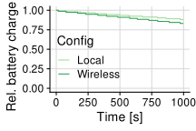<!-- -->

Print battery usage statistics to use in the article.

``` r
data %>%
  filter(ts > tmin & ts < tmax) %>%
  mutate(ts = ts - min(ts)) %>%
  group_by(config) %>%
  summarize(max = max(battery), min = min(battery), diff = max - min, diff_per_minute = 60 * diff / (tmax - tmin), max_play_time = 100 / diff_per_minute)
```

    ## # A tibble: 3 × 6
    ##   config     max   min  diff diff_per_minute max_play_time
    ##   <chr>    <dbl> <dbl> <dbl>           <dbl>         <dbl>
    ## 1 Local       92    81    11            0.66          152.
    ## 2 Wired       72    72     0            0             Inf 
    ## 3 Wireless    77    64    13            0.78          128.

Plot the expected total battery lifetime based on the observed battery
levels.

``` r
data %>%
  filter(config != "Wired") %>%
  group_by(config) %>%
  filter(ts > tmin & ts < tmax) %>%
  mutate(ts = ts - min(ts)) %>%
  group_by(config) %>%
  summarize(max = max(battery), min = min(battery), diff = max - min, diff_per_minute = 60 * diff / (tmax - tmin), max_play_time = 100 / diff_per_minute) %>%
  ggplot(aes(x = max_play_time, y = config)) +
  geom_col() +
  theme_half_open() +
  background_grid() +
  labs(x = "Approx. maximum battery life [m]                ", y = "Config")
```

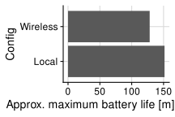<!-- -->

### Controllers

Plot the battery levels of the controllers for varying configurations.

``` r
data <- NULL
for (f in experiments) {
  data <- system(paste("grep -Po '(?<=Type:)\\s+(Left|Right),.+Battery:\\s+[0-9]+(?=%)'", here("experiments", f, "OVRRemoteService.log"), "| tr -s ' ' | sed -e \'s/^[[:space:]]*//\' -e \'s/\\n[[:space:]]*//\' | cut -d' ' -f 1,5"), intern = TRUE) %>%
    tibble(battery = .) %>%
    separate(battery, c("hand", "level"), convert = TRUE) %>%
    group_by(hand) %>%
    mutate(ts = 0:(n() - 1)) %>%
    select(ts, everything()) %>%
    mutate(config = f) %>%
    bind_rows(data, .)
}
data %>%
  ggplot(aes(x = ts, y = level, color = config, shape = hand, group = interaction(config, hand))) +
  geom_line() +
  ylim(0, NA) +
  theme_half_open() +
  background_grid()
```

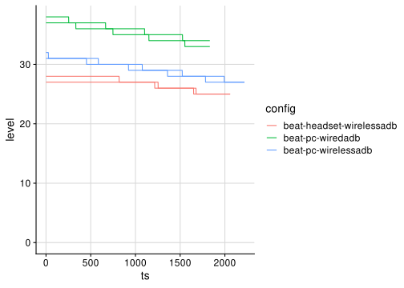<!-- -->

Calculate expected battery life for the controllers for varying
configurations.

``` r
d <- data %>%
  group_by(hand, config) %>%
  summarize(max = max(level), min = min(level), diff = max - min, diff_per_minute = 60 * diff / (tmax - tmin), max_play_time = 100 / diff_per_minute) %>%
  group_by(config) %>%
  print()
```

    ## `summarise()` has grouped output by 'hand'. You can override using the
    ## `.groups` argument.

    ## # A tibble: 6 × 7
    ## # Groups:   config [3]
    ##   hand  config                     max   min  diff diff_per_minute max_play_time
    ##   <chr> <chr>                    <int> <int> <int>           <dbl>         <dbl>
    ## 1 Left  beat-headset-wirelessadb    28    25     3            0.18          556.
    ## 2 Left  beat-pc-wiredadb            37    33     4            0.24          417.
    ## 3 Left  beat-pc-wirelessadb         31    27     4            0.24          417.
    ## 4 Right beat-headset-wirelessadb    27    25     2            0.12          833.
    ## 5 Right beat-pc-wiredadb            38    34     4            0.24          417.
    ## 6 Right beat-pc-wirelessadb         32    27     5            0.3           333.

``` r
d %>%
  summarize(max_play_time = max(max_play_time)) %>%
  print()
```

    ## # A tibble: 3 × 2
    ##   config                   max_play_time
    ##   <chr>                            <dbl>
    ## 1 beat-headset-wirelessadb          833.
    ## 2 beat-pc-wiredadb                  417.
    ## 3 beat-pc-wirelessadb               417.

Function for translating filenames into human-readable names.

``` r
to_human_name <- function(name) {
  if (name == "headset-cable-2") {
    "Local"
  } else if (name == "oculus-cable-2") {
    "Wired"
  } else if (name == "oculus-wireless-dynamic-100-mix-5ghz-2") {
    "Wireless"
  } else {
    name
  }
}

experiments <- c("headset-cable-2", "oculus-cable-2", "oculus-wireless-dynamic-100-mix-5ghz-2")
start_time <- 125
end_time <- 350
```

Reading measurement data into tables.

``` r
data <- NULL
for (f in experiments) {
  data <- system(paste('grep -Po "(?<=FPS=)[0-9]+"', here("experiments", f, "logcat_VrApi.log")), intern = TRUE) %>%
    tibble(fps = .) %>%
    mutate(fps = as.numeric(fps)) %>%
    mutate(ts = 0:(n() - 1)) %>%
    select(ts, everything()) %>%
    mutate(config = f) %>%
    bind_rows(data, .)
}
data <- data %>%
  mutate(config = map_chr(config, to_human_name))
```

Exploratory plot showing the frame rate over time for varying
configurations.

``` r
data %>%
  ggplot(aes(x = ts, y = fps, color = config)) +
  geom_vline(xintercept = start_time, color = "black") +
  geom_vline(xintercept = end_time, color = "black") +
  geom_line() +
  ylim(0, NA) +
  theme_half_open() +
  background_grid() +
  theme(legend.position = "bottom") +
  scale_color_viridis_d(begin = 0.3, direction = -1)
```

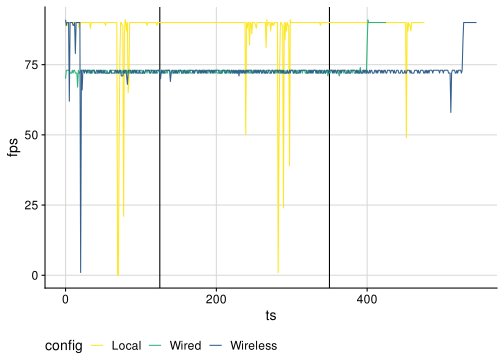<!-- -->

### Figure 5a

``` r
data %>%
  filter(ts >= start_time & ts <= end_time) %>%
  ggplot(aes(x = fps, y = config)) +
  geom_boxplot() +
  xlim(0, NA) +
  labs(x = "Frames per second", y = "Setup") +
  theme_half_open() +
  background_grid() +
  theme(legend.position = "bottom") +
  scale_color_viridis_d(begin = 0.3, direction = -1)
```

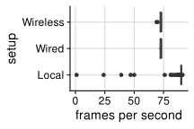<!-- -->

### Operational Plot for Figure 5a

Operational plot showing the CPU utilization for varying configurations.

``` r
cpu_data <- NULL
for (f in experiments) {
  cpu_data <- system(paste('grep -Po "(?<=CPU%=)[0-9]+.[0-9]+"', here("experiments", f, "logcat_VrApi.log")), intern = TRUE) %>%
    tibble(cpu_util = .) %>%
    mutate(cpu_util = 100 * as.numeric(cpu_util)) %>%
    mutate(ts = 0:(n() - 1)) %>%
    select(ts, everything()) %>%
    mutate(config = f) %>%
    bind_rows(cpu_data, .)
}
cpu_data <- cpu_data %>%
  mutate(config = map_chr(config, to_human_name))
```

``` r
cpu_data %>%
  ggplot(aes(x = ts, y = cpu_util, color = config)) +
  geom_vline(xintercept = start_time, color = "black") +
  geom_vline(xintercept = end_time, color = "black") +
  geom_line() +
  ylim(0, NA) +
  theme_half_open() +
  background_grid() +
  theme(legend.position = "bottom") +
  scale_color_viridis_d(begin = 0.3, direction = -1)
```

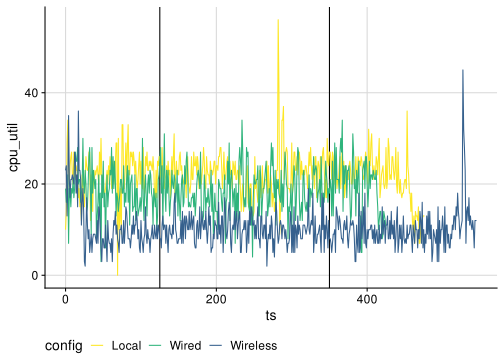<!-- -->

### Figure 5b

``` r
cpu_data %>%
  filter(ts >= start_time & ts <= end_time) %>%
  ggplot(aes(x = cpu_util, y = config)) +
  geom_boxplot() +
  xlim(0, NA) +
  labs(x = "CPU utilization [%]", y = "Setup") +
  theme_half_open() +
  background_grid()
```

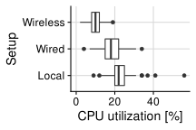<!-- -->

### Operational Plot for Figure 5b

``` r
data <- NULL
for (f in experiments) {
  data <- system(paste('grep -Po "(?<=GPU%=)[0-9]+.[0-9]+"', here("experiments", f, "logcat_VrApi.log")), intern = TRUE) %>%
    tibble(gpu_util = .) %>%
    mutate(gpu_util = 100 * as.numeric(gpu_util)) %>%
    mutate(ts = 0:(n() - 1)) %>%
    select(ts, everything()) %>%
    mutate(config = f) %>%
    bind_rows(data, .)
}
data <- data %>%
  mutate(config = map_chr(config, to_human_name))
```

``` r
data %>%
  ggplot(aes(x = ts, y = gpu_util, color = config)) +
  geom_vline(xintercept = start_time, color = "black") +
  geom_vline(xintercept = end_time, color = "black") +
  geom_line() +
  ylim(0, NA) +
  theme_half_open() +
  background_grid() +
  theme(legend.position = "bottom") +
  scale_color_viridis_d(begin = 0.3, direction = -1)
```

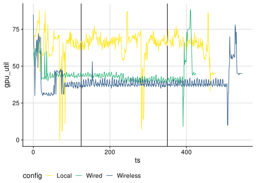<!-- -->

### Figure 5c

``` r
data %>%
  filter(ts >= start_time & ts <= end_time) %>%
  ggplot(aes(x = gpu_util, y = config)) +
  geom_boxplot() +
  xlim(0, NA) +
  labs(y = "Setup", x = "GPU utilization [%]") +
  theme_half_open() +
  background_grid() +
  theme(legend.position = "none") +
  scale_color_viridis_d(begin = 0.3, direction = -1)
```

<!-- -->

### Operational Plot for Figure 5c

``` r
data <- read_csv(here("experiments", "beat-pc-wiredadb", "usb_packet_data.csv"))
```

    ## Rows: 7053933 Columns: 7
    ## ── Column specification ────────────────────────────────────────────────────────
    ## Delimiter: ","
    ## chr (4): Source, Destination, Protocol, Info
    ## dbl (3): No., Time, Length
    ## 
    ## ℹ Use `spec()` to retrieve the full column specification for this data.
    ## ℹ Specify the column types or set `show_col_types = FALSE` to quiet this message.

``` r
data %>%
  filter(Source == "host") %>%
  mutate(second = as.integer(Time)) %>%
  group_by(second) %>%
  summarize(Mbps = 8 * sum(Length) / 1000000) %>%
  ggplot(aes(x = second, y = Mbps)) +
  geom_line() +
  theme_half_open() +
  background_grid()
```

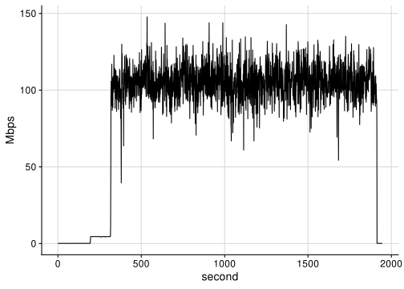<!-- -->

``` r
data %>%
  filter(Source == "host") %>%
  mutate(second = as.integer(Time)) %>%
  group_by(second) %>%
  summarize(Mbps = 8 * sum(Length) / 1000000) %>%
  ggplot(aes(x = Mbps)) +
  geom_boxplot() +
  theme_half_open() +
  background_grid()
```

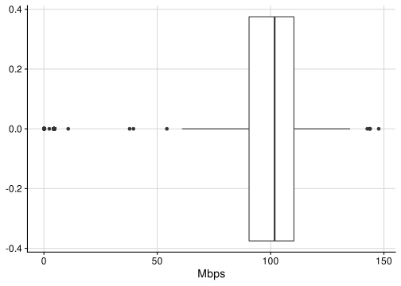<!-- -->

``` r
data %>%
  filter(Source == "host") %>%
  mutate(second = as.integer(Time)) %>%
  group_by(second) %>%
  summarize(Mbps = 8 * sum(Length) / 1000000) %>%
  ungroup() %>%
  summarize(p25 = quantile(Mbps, 0.25), p50 = quantile(Mbps, 0.5), p75 = quantile(Mbps, 0.75))
```

    ## # A tibble: 1 × 3
    ##     p25   p50   p75
    ##   <dbl> <dbl> <dbl>
    ## 1  90.5  102.  110.

``` r
data %>%
  mutate(mode = ifelse(Source == "host", "receive", ifelse(Destination == "host", "send", "other"))) %>%
  filter(mode != "other") %>%
  mutate(second = as.integer(Time)) %>%
  group_by(mode, second) %>%
  summarize(Mbps = 8 * sum(Length) / 1000000) %>%
  ggplot(aes(x = second, y = Mbps, color = mode)) +
  geom_line() +
  theme_half_open() +
  background_grid()
```

    ## `summarise()` has grouped output by 'mode'. You can override using the
    ## `.groups` argument.

<!-- -->

``` r
data %>%
  filter(Source == "host") %>%
  mutate(second = as.integer(Time)) %>%
  group_by(Destination, second) %>%
  summarize(Mbps = 8 * sum(Length) / 1000000) %>%
  ggplot(aes(x = second, y = Mbps, color = Destination)) +
  geom_line() +
  theme_half_open() +
  background_grid()
```

    ## `summarise()` has grouped output by 'Destination'. You can override using the
    ## `.groups` argument.

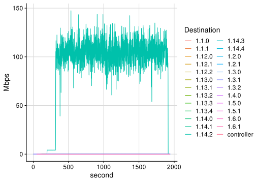<!-- -->

``` r
network_data <- NULL
for (f in experiments) {
  network_data <- system(paste('grep -P "\\s+wlan0\\W"', here("experiments", f, "net_dev.log"), '| tr -s " " | sed -e \'s/^[[:space:]]*//\' -e \'s/\\n[[:space:]]*//\''), intern = TRUE) %>%
    tibble(network = .) %>%
    separate(network, c("interface", "bytes_rx", "packets_rx", "errs_rx", "drop_rx", "fifo_rx", "frame_rx", "compressed_rx", "multicast_rx", "bytes_tx", "packets_tx", "errs_tx", "drop_tx", "fifo_tx", "colls_tx", "carrier_tx", "compressed_tx"), sep = " ", convert = TRUE) %>%
    mutate(ts = 0:(n() - 1)) %>%
    mutate(config = f) %>%
    bind_rows(network_data, .)
}
```

``` r
network_data %>%
  mutate(bytes_rx = 8 * (bytes_rx - lag(bytes_rx)) / 1000000) %>%
  drop_na() %>%
  ggplot(aes(x = ts, y = bytes_rx, color = config)) +
  geom_line() +
  ylab("Bytes received [Mbps]") +
  ylim(0, NA) +
  # scale_y_continuous(trans = "log10") +
  theme_half_open() +
  background_grid()
```

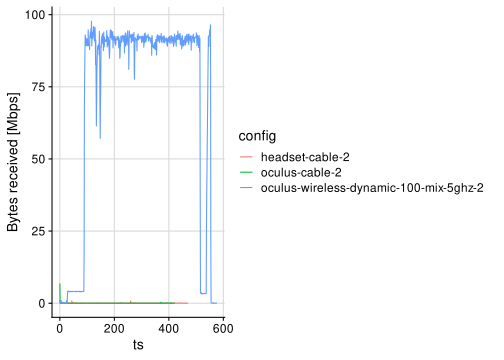<!-- -->

``` r
network_data %>%
  mutate(bytes_rx = 8 * (bytes_rx - lag(bytes_rx)) / 1000000) %>%
  drop_na() %>%
  filter(ts >= 200 & ts <= 400) %>%
  mutate(config = map_chr(config, to_human_name)) %>%
  ggplot(aes(x = bytes_rx, y = config)) +
  geom_boxplot() +
  labs(x = "Bytes received [Mbps]", y = "Setup") +
  xlim(0, 100) +
  # scale_x_continuous(trans = "log10") +
  theme_half_open() +
  background_grid() +
  theme(legend.position = "bottom")
```

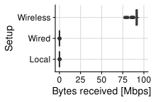<!-- -->

``` r
mem_data <- NULL
for (f in experiments) {
  mem_data <- system(paste('grep -Po "(?<=Free=)[0-9]+"', here("experiments", f, "logcat_VrApi.log")), intern = TRUE) %>%
    tibble(mem_usage = .) %>%
    mutate(mem_usage = 12288 - as.numeric(mem_usage)) %>%
    mutate(mem_usage = mem_usage / 1024) %>%
    mutate(ts = 0:(n() - 1)) %>%
    select(ts, everything()) %>%
    mutate(config = f) %>%
    bind_rows(mem_data, .)
}
mem_data <- mem_data %>%
  mutate(config = map_chr(config, to_human_name))
```

``` r
mem_data %>%
  ggplot(aes(x = ts, y = mem_usage, color = config)) +
  geom_line() +
  ylim(0, 11.5) +
  theme_half_open() +
  background_grid() +
  labs(x = "Time [s]", y = "Memory usage [GB]     ")
```

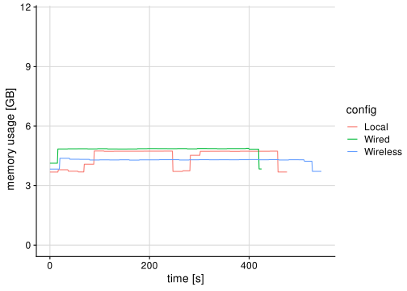<!-- -->

``` r
mem_data %>%
  ggplot(aes(x = mem_usage, y = config)) +
  geom_boxplot() +
  xlim(0, NA) +
  theme_half_open() +
  background_grid() +
  labs(x = "Memory usage [GB]", y = "Setup")
```

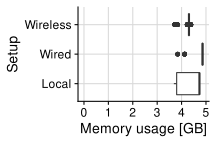<!-- -->

# Effect of WiFi Networks

``` r
to_human_name <- function(name) {
  if (name == "oculus-wireless-dynamic-100-b_g_n-2_4ghz") {
    "2.4GHz WiFi 4"
  } else if (name == "oculus-wireless-dynamic-100-ax-5ghz") {
    "5GHz WiFi 6"
  } else if (name == "oculus-wireless-dynamic-100-ax-2_4ghz") {
    "2.4GHz WiFi 6"
  } else if (name == "oculus-wireless-dynamic-100-a_n_ac-5ghz") {
    "5GHz WiFi 5"
  } else if (name == "oculus-wireless-dynamic-100-mix-5ghz-2") {
    "5GHz WiFi 5/6"
  } else {
    name
  }
}

wifi_order <- c("2.4GHz WiFi 4", "5GHz WiFi 5", "5GHz WiFi 5/6", "2.4GHz WiFi 6", "5GHz WiFi 6")
experiments <- c("oculus-wireless-dynamic-100-mix-5ghz-2", "oculus-wireless-dynamic-100-a_n_ac-5ghz", "oculus-wireless-dynamic-100-ax-2_4ghz", "oculus-wireless-dynamic-100-ax-5ghz", "oculus-wireless-dynamic-100-b_g_n-2_4ghz")
# experiments <- c("oculus-wireless-dynamic-100-a_n_ac-5ghz", "oculus-wireless-dynamic-100-ax-2_4ghz", "oculus-wireless-dynamic-100-ax-5ghz", "oculus-wireless-dynamic-100-b_g_n-2_4ghz")
start_time <- 125
end_time <- 350
```

``` r
data <- NULL
for (f in experiments) {
  data <- system(paste('grep -Po "(?<=FPS=)[0-9]+"', here("experiments", f, "logcat_VrApi.log")), intern = TRUE) %>%
    tibble(fps = .) %>%
    mutate(fps = as.numeric(fps)) %>%
    mutate(ts = 0:(n() - 1)) %>%
    select(ts, everything()) %>%
    mutate(config = f) %>%
    bind_rows(data, .)
}
data <- data %>%
  mutate(config = map_chr(config, to_human_name))
```

``` r
data %>%
  ggplot(aes(x = ts, y = fps, color = config)) +
  geom_vline(xintercept = start_time, color = "black") +
  geom_vline(xintercept = end_time, color = "black") +
  geom_line() +
  ylim(0, NA) +
  theme_half_open() +
  background_grid() +
  theme(legend.position = "bottom") +
  scale_color_viridis_d(begin = 0.3, direction = -1)
```

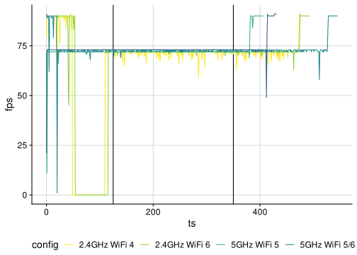<!-- -->

### Figure 7b

``` r
data %>%
  filter(ts >= start_time & ts <= end_time) %>%
  mutate(config = factor(config, levels = wifi_order)) %>%
  ggplot(aes(x = fps, y = config)) +
  # geom_vline(xintercept = 72, color = "green") +
  geom_boxplot() +
  xlim(0, NA) +
  labs(x = "Frames per second ", y = "Network type") +
  # scale_x_break(breaks = c(15, 55), scales = 2) +
  theme_half_open() +
  background_grid() +
  # scale_x_break(c(10, 50)) +
  theme(legend.position = "bottom") +
  scale_color_viridis_d(begin = 0.3, direction = -1)
```

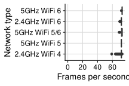<!-- -->

``` r
data %>%
  filter(ts >= start_time & ts <= end_time) %>%
  mutate(config = factor(config, levels = wifi_order)) %>%
  group_by(config) %>%
  summarize(min = min(fps), p01 = quantile(fps, 0.01), p05 = quantile(fps, 0.05), p10 = quantile(fps, 0.1), mean = mean(fps), median = median(fps), max = max(fps))
```

    ## # A tibble: 5 × 8
    ##   config          min   p01   p05   p10  mean median   max
    ##   <fct>         <dbl> <dbl> <dbl> <dbl> <dbl>  <dbl> <dbl>
    ## 1 2.4GHz WiFi 4    59  65.2    68    70  71.4     72    73
    ## 2 5GHz WiFi 5      72  72      72    72  72       72    72
    ## 3 5GHz WiFi 5/6    69  71.2    72    72  72.5     73    73
    ## 4 2.4GHz WiFi 6    70  70.2    72    72  72.0     72    72
    ## 5 5GHz WiFi 6      72  73      73    73  73.0     73    73

``` r
cpu_data <- NULL
for (f in experiments) {
  cpu_data <- system(paste('grep -Po "(?<=CPU%=)[0-9]+.[0-9]+"', here("experiments", f, "logcat_VrApi.log")), intern = TRUE) %>%
    tibble(cpu_util = .) %>%
    mutate(cpu_util = 100 * as.numeric(cpu_util)) %>%
    mutate(ts = 0:(n() - 1)) %>%
    select(ts, everything()) %>%
    mutate(config = f) %>%
    bind_rows(cpu_data, .)
}
cpu_data <- cpu_data %>%
  mutate(config = map_chr(config, to_human_name))
```

``` r
cpu_data %>%
  ggplot(aes(x = ts, y = cpu_util, color = config)) +
  geom_vline(xintercept = start_time, color = "black") +
  geom_vline(xintercept = end_time, color = "black") +
  geom_line() +
  ylim(0, NA) +
  theme_half_open() +
  background_grid() +
  theme(legend.position = "bottom") +
  scale_color_viridis_d(begin = 0.3, direction = -1)
```

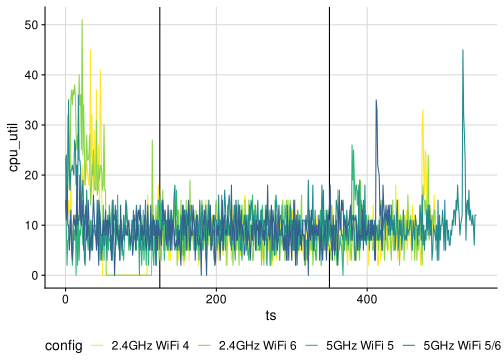<!-- -->

``` r
cpu_data %>%
  filter(ts >= start_time & ts <= end_time) %>%
  mutate(config = factor(config, levels = wifi_order)) %>%
  ggplot(aes(x = cpu_util, y = config)) +
  geom_boxplot() +
  xlim(0, NA) +
  labs(x = "CPU utilization [%]", y = "Network type") +
  theme_half_open() +
  background_grid()
```

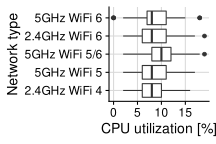<!-- -->

``` r
data <- NULL
for (f in experiments) {
  data <- system(paste('grep -Po "(?<=GPU%=)[0-9]+.[0-9]+"', here("experiments", f, "logcat_VrApi.log")), intern = TRUE) %>%
    tibble(gpu_util = .) %>%
    mutate(gpu_util = 100 * as.numeric(gpu_util)) %>%
    mutate(ts = 0:(n() - 1)) %>%
    select(ts, everything()) %>%
    mutate(config = f) %>%
    bind_rows(data, .)
}
data <- data %>%
  mutate(config = map_chr(config, to_human_name))
```

``` r
data %>%
  ggplot(aes(x = ts, y = gpu_util, color = config)) +
  geom_vline(xintercept = start_time, color = "black") +
  geom_vline(xintercept = end_time, color = "black") +
  geom_line() +
  ylim(0, NA) +
  theme_half_open() +
  background_grid() +
  theme(legend.position = "bottom") +
  scale_color_viridis_d(begin = 0.3, direction = -1)
```

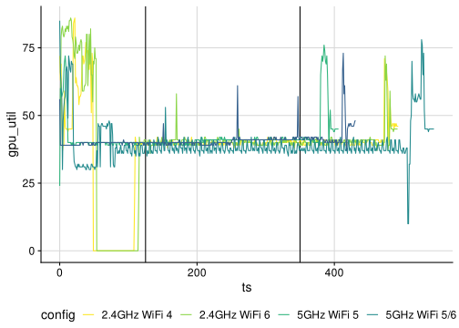<!-- -->

``` r
data %>%
  filter(ts >= start_time & ts <= end_time) %>%
  mutate(config = factor(config, levels = wifi_order)) %>%
  ggplot(aes(x = gpu_util, y = config)) +
  geom_boxplot() +
  xlim(0, NA) +
  labs(y = "Network type", x = "GPU utilization [%]") +
  theme_half_open() +
  background_grid() +
  theme(legend.position = "none") +
  scale_color_viridis_d(begin = 0.3, direction = -1)
```

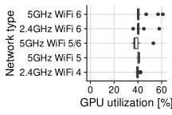<!-- -->

``` r
network_data <- NULL
for (f in experiments) {
  network_data <- system(paste('grep -P "\\s+wlan0\\W"', here("experiments", f, "net_dev.log"), '| tr -s " " | sed -e \'s/^[[:space:]]*//\' -e \'s/\\n[[:space:]]*//\''), intern = TRUE) %>%
    tibble(network = .) %>%
    separate(network, c("interface", "bytes_rx", "packets_rx", "errs_rx", "drop_rx", "fifo_rx", "frame_rx", "compressed_rx", "multicast_rx", "bytes_tx", "packets_tx", "errs_tx", "drop_tx", "fifo_tx", "colls_tx", "carrier_tx", "compressed_tx"), sep = " ", convert = TRUE) %>%
    mutate(ts = 0:(n() - 1)) %>%
    mutate(config = f) %>%
    bind_rows(network_data, .)
}
```

``` r
network_data %>%
  mutate(bytes_rx = 8 * (bytes_rx - lag(bytes_rx)) / 1000000) %>%
  drop_na() %>%
  ggplot(aes(x = ts, y = bytes_rx, color = config)) +
  geom_line() +
  ylab("Bytes received [Mbps]") +
  ylim(0, NA) +
  # scale_y_continuous(trans = "log10") +
  theme_half_open() +
  background_grid()
```

    ## Warning: Removed 2 row(s) containing missing values (geom_path).

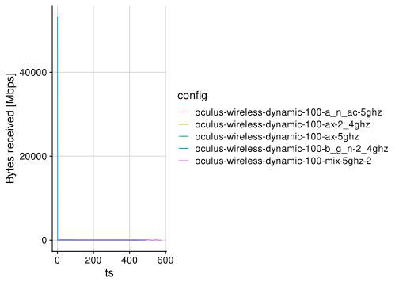<!-- -->

### Figure 7a

``` r
network_data %>%
  mutate(bytes_rx = 8 * (bytes_rx - lag(bytes_rx)) / 1000000) %>%
  drop_na() %>%
  filter(ts >= 200 & ts <= 400) %>%
  mutate(config = map_chr(config, to_human_name)) %>%
  mutate(config = factor(config, levels = wifi_order)) %>%
  ggplot(aes(x = bytes_rx, y = config)) +
  geom_boxplot() +
  labs(x = "Bytes received [Mbps]      ", y = "Network type") +
  xlim(0, 100) +
  # scale_x_continuous(trans = "log10") +
  theme_half_open() +
  background_grid() +
  theme(legend.position = "bottom")
```

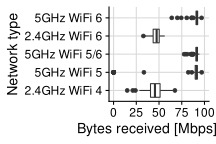<!-- -->

``` r
network_data %>%
  mutate(bytes_rx = 8 * (bytes_rx - lag(bytes_rx)) / 1000000) %>%
  drop_na() %>%
  filter(ts >= 200 & ts <= 400) %>%
  mutate(config = map_chr(config, to_human_name)) %>%
  mutate(config = factor(config, levels = wifi_order)) %>%
  group_by(config) %>%
  summarize(mean = mean(bytes_rx), median = median(bytes_rx))
```

    ## # A tibble: 5 × 3
    ##   config         mean median
    ##   <fct>         <dbl>  <dbl>
    ## 1 2.4GHz WiFi 4  45.9   45.5
    ## 2 5GHz WiFi 5    82.3   91.1
    ## 3 5GHz WiFi 5/6  91.1   91.7
    ## 4 2.4GHz WiFi 6  46.6   47.4
    ## 5 5GHz WiFi 6    91.1   91.8

``` r
mem_data <- NULL
for (f in experiments) {
  mem_data <- system(paste('grep -Po "(?<=Free=)[0-9]+"', here("experiments", f, "logcat_VrApi.log")), intern = TRUE) %>%
    tibble(mem_usage = .) %>%
    mutate(mem_usage = 12288 - as.numeric(mem_usage)) %>%
    mutate(mem_usage = mem_usage / 1024) %>%
    mutate(ts = 0:(n() - 1)) %>%
    select(ts, everything()) %>%
    mutate(config = f) %>%
    bind_rows(mem_data, .)
}
mem_data <- mem_data %>%
  mutate(config = map_chr(config, to_human_name))
```

``` r
mem_data %>%
  ggplot(aes(x = ts, y = mem_usage, color = config)) +
  geom_line() +
  ylim(0, 11.5) +
  theme_half_open() +
  background_grid() +
  labs(x = "Time [s]", y = "Memory usage [GB]     ")
```

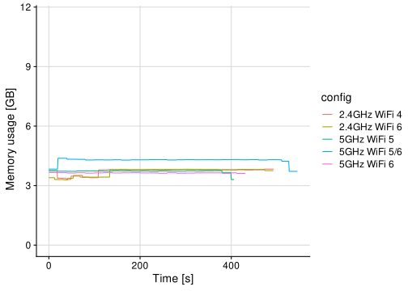<!-- -->

``` r
mem_data %>%
  ggplot(aes(x = mem_usage, y = config)) +
  geom_boxplot() +
  xlim(0, NA) +
  theme_half_open() +
  background_grid() +
  labs(x = "Memory usage [GB]    ", y = "Setup")
```

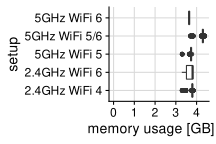<!-- -->

# Impact of WiFi Distance

``` r
to_human_name <- function(name) {
  if (name == "alyx-wired") {
    "Wired"
  } else if (name == "alyx-wireless") {
    "Near"
  } else if (name == "alyx-wireless-upstairs") {
    "Far"
  } else {
    name
  }
}

wifi_order <- c("Wired", "Near", "Far")
experiments <- c("alyx-wired", "alyx-wireless", "alyx-wireless-upstairs")
# experiments <- c("oculus-wireless-dynamic-100-a_n_ac-5ghz", "oculus-wireless-dynamic-100-ax-2_4ghz", "oculus-wireless-dynamic-100-ax-5ghz", "oculus-wireless-dynamic-100-b_g_n-2_4ghz")
start_time <- 125
end_time <- 900
```

``` r
data <- NULL
for (f in experiments) {
  data <- system(paste('grep -Po "(?<=FPS=)[0-9]+"', here("experiments", f, "logcat_VrApi.log")), intern = TRUE) %>%
    tibble(fps = .) %>%
    mutate(fps = as.numeric(fps)) %>%
    mutate(ts = 0:(n() - 1)) %>%
    select(ts, everything()) %>%
    mutate(config = f) %>%
    bind_rows(data, .)
}
data <- data %>%
  mutate(config = map_chr(config, to_human_name))
```

### Figure 6b

``` r
my_colors <- RColorBrewer::brewer.pal(3, "Greens")[2:3]
data %>%
  filter(config == "Far" | config == "Near") %>%
  filter(ts >= start_time & ts <= end_time) %>%
  mutate(ts = ts - min(ts)) %>%
  ggplot(aes(x = ts, y = fps, color = config)) +
  geom_line() +
  xlim(0, NA) +
  theme_half_open() +
  background_grid() +
  theme(legend.position = c(0.05, 0.10), legend.direction = "horizontal") +
  labs(x = "Time [s]", y = "Frames per second         ") +
  scale_color_manual(values = my_colors)
```

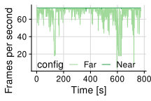<!-- -->

### Figure 1

``` r
my_colors <- RColorBrewer::brewer.pal(3, "Greens")[2:3]
data %>%
  filter(config == "Far" | config == "Near") %>%
  filter(ts >= start_time & ts <= end_time) %>%
  mutate(ts = ts - min(ts)) %>%
  ggplot(aes(x = ts, y = fps, color = config)) +
  geom_line(size = 1) +
  xlim(0, NA) +
  ylim(0, 100) +
  theme_half_open() +
  background_grid() +
  theme(legend.position = c(0.04, 0.85), legend.direction = "horizontal") +
  labs(x = "Time [s]", y = "Frames per second         ") +
  scale_color_manual(values = my_colors, name = "Proximity of wireless access point") +
  # scale_size_manual(values = c(Near = 1, Far = 1), name = "") +
  annotate("text", x = 0, y = 10, label = "Target frame rate: 72 Hz. Higher is better", fill = "white", label.size = NA, hjust = 0, size = 5)
```

    ## Warning: Ignoring unknown parameters: fill, label.size

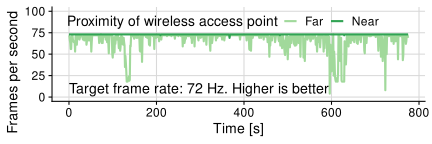<!-- -->

### Figure 6a

``` r
data %>%
  filter(ts >= start_time & ts <= end_time) %>%
  mutate(config = factor(config, levels = wifi_order)) %>%
  ggplot(aes(x = fps, y = config)) +
  geom_boxplot() +
  xlim(0, NA) +
  labs(x = "Frames per second ", y = "AP distance") +
  theme_half_open() +
  background_grid() +
  # scale_x_break(c(10, 50)) +
  theme(legend.position = "bottom") +
  scale_color_viridis_d(begin = 0.3, direction = -1)
```

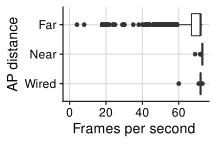<!-- -->

``` r
cpu_data <- NULL
for (f in experiments) {
  cpu_data <- system(paste('grep -Po "(?<=CPU%=)[0-9]+.[0-9]+"', here("experiments", f, "logcat_VrApi.log")), intern = TRUE) %>%
    tibble(cpu_util = .) %>%
    mutate(cpu_util = 100 * as.numeric(cpu_util)) %>%
    mutate(ts = 0:(n() - 1)) %>%
    select(ts, everything()) %>%
    mutate(config = f) %>%
    bind_rows(cpu_data, .)
}
cpu_data <- cpu_data %>%
  mutate(config = map_chr(config, to_human_name))
```

``` r
cpu_data %>%
  ggplot(aes(x = ts, y = cpu_util, color = config)) +
  geom_vline(xintercept = start_time, color = "black") +
  geom_vline(xintercept = end_time, color = "black") +
  geom_line() +
  ylim(0, NA) +
  theme_half_open() +
  background_grid() +
  theme(legend.position = "bottom") +
  scale_color_viridis_d(begin = 0.3, direction = -1)
```

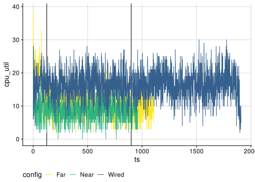<!-- -->

``` r
cpu_data %>%
  filter(ts >= start_time & ts <= end_time) %>%
  mutate(config = factor(config, levels = wifi_order)) %>%
  ggplot(aes(x = cpu_util, y = config)) +
  geom_boxplot() +
  xlim(0, NA) +
  labs(x = "CPU utilization [%]", y = "AP distance") +
  theme_half_open() +
  background_grid()
```

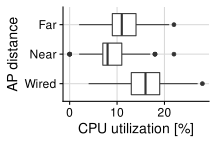<!-- -->

``` r
data <- NULL
for (f in experiments) {
  data <- system(paste('grep -Po "(?<=GPU%=)[0-9]+.[0-9]+"', here("experiments", f, "logcat_VrApi.log")), intern = TRUE) %>%
    tibble(gpu_util = .) %>%
    mutate(gpu_util = 100 * as.numeric(gpu_util)) %>%
    mutate(ts = 0:(n() - 1)) %>%
    select(ts, everything()) %>%
    mutate(config = f) %>%
    bind_rows(data, .)
}
data <- data %>%
  mutate(config = map_chr(config, to_human_name))
```

``` r
data %>%
  ggplot(aes(x = ts, y = gpu_util, color = config)) +
  geom_vline(xintercept = start_time, color = "black") +
  geom_vline(xintercept = end_time, color = "black") +
  geom_line() +
  ylim(0, NA) +
  theme_half_open() +
  background_grid() +
  theme(legend.position = "bottom") +
  scale_color_viridis_d(begin = 0.3, direction = -1)
```

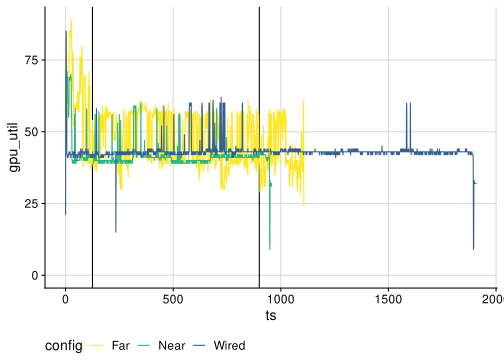<!-- -->

### Figure 6c

``` r
data %>%
  filter(ts >= start_time & ts <= end_time) %>%
  mutate(config = factor(config, levels = wifi_order)) %>%
  ggplot(aes(x = gpu_util, y = config)) +
  geom_boxplot() +
  xlim(0, NA) +
  labs(y = "AP distance", x = "GPU utilization [%]") +
  theme_half_open() +
  background_grid() +
  theme(legend.position = "none") +
  scale_color_viridis_d(begin = 0.3, direction = -1)
```

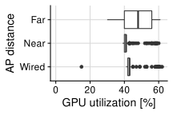<!-- -->

``` r
network_data <- NULL
for (f in experiments) {
  network_data <- system(paste('grep -P "\\s+wlan0\\W"', here("experiments", f, "net_dev.log"), '| tr -s " " | sed -e \'s/^[[:space:]]*//\' -e \'s/\\n[[:space:]]*//\''), intern = TRUE) %>%
    tibble(network = .) %>%
    separate(network, c("interface", "bytes_rx", "packets_rx", "errs_rx", "drop_rx", "fifo_rx", "frame_rx", "compressed_rx", "multicast_rx", "bytes_tx", "packets_tx", "errs_tx", "drop_tx", "fifo_tx", "colls_tx", "carrier_tx", "compressed_tx"), sep = " ", convert = TRUE) %>%
    mutate(ts = 0:(n() - 1)) %>%
    mutate(config = f) %>%
    bind_rows(network_data, .)
}
```

``` r
network_data %>%
  mutate(bytes_rx = 8 * (bytes_rx - lag(bytes_rx)) / 1000000) %>%
  drop_na() %>%
  ggplot(aes(x = ts, y = bytes_rx, color = config)) +
  geom_line() +
  ylab("Bytes received [Mbps]") +
  ylim(0, NA) +
  # scale_y_continuous(trans = "log10") +
  theme_half_open() +
  background_grid()
```

    ## Warning: Removed 1 row(s) containing missing values (geom_path).

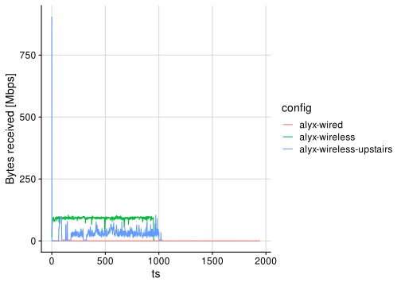<!-- -->

``` r
network_data %>%
  mutate(bytes_rx = 8 * (bytes_rx - lag(bytes_rx)) / 1000000) %>%
  drop_na() %>%
  filter(ts >= 200 & ts <= 400) %>%
  mutate(config = map_chr(config, to_human_name)) %>%
  mutate(config = factor(config, levels = wifi_order)) %>%
  ggplot(aes(x = bytes_rx, y = config)) +
  geom_boxplot() +
  labs(x = "Bytes received [Mbps]      ", y = "AP distance") +
  xlim(0, 100) +
  # scale_x_continuous(trans = "log10") +
  theme_half_open() +
  background_grid() +
  theme(legend.position = "bottom")
```

    ## Warning: Removed 1 rows containing non-finite values (stat_boxplot).

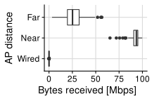<!-- -->

### Figure 6d

``` r
frankenstein <- network_data %>%
  mutate(Mbps = 8 * (bytes_rx - lag(bytes_rx)) / 1000000) %>%
  drop_na() %>%
  filter(ts >= 200 & ts <= 400) %>%
  mutate(config = map_chr(config, to_human_name)) %>%
  mutate(config = factor(config, levels = wifi_order)) %>%
  select(config, Mbps) %>%
  filter(config != "Wired")


data <- read_csv(here("experiments", "beat-pc-wiredadb", "usb_packet_data.csv"))
```

    ## Rows: 7053933 Columns: 7
    ## ── Column specification ────────────────────────────────────────────────────────
    ## Delimiter: ","
    ## chr (4): Source, Destination, Protocol, Info
    ## dbl (3): No., Time, Length
    ## 
    ## ℹ Use `spec()` to retrieve the full column specification for this data.
    ## ℹ Specify the column types or set `show_col_types = FALSE` to quiet this message.

``` r
wired <- "*Wired*<br>*(USB)*"
my.labels <- c(wired, "Near", "Far")

frankenstein <- data %>%
  filter(Source == "host") %>%
  mutate(second = as.integer(Time)) %>%
  filter(second >= 500 & second <= 1750) %>%
  group_by(second) %>%
  summarize(Mbps = 8 * sum(Length) / 1000000) %>%
  mutate(config = wired) %>%
  select(config, Mbps) %>%
  bind_rows(frankenstein)

frankenstein %>%
  mutate(config = factor(config, levels = my.labels)) %>%
  ggplot(aes(x = Mbps, y = config)) +
  geom_boxplot() +
  labs(x = "Bytes received [Mbps]      ", y = "AP distance") +
  xlim(0, 100) +
  # scale_x_continuous(trans = "log10") +
  theme_half_open() +
  background_grid() +
  theme(legend.position = "bottom") +
  theme(axis.text.y = element_markdown()) +
  annotate("rect", xmin = -Inf, xmax = Inf, ymin = .5, ymax = 1.5, alpha = .2)
```

    ## Warning: Removed 868 rows containing non-finite values (stat_boxplot).

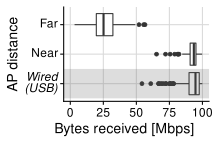<!-- -->

``` r
# #Plot
# ggplot(data=samplecounts,aes(variable2,variable1))+
#   geom_col(color='black')+
#   scale_x_discrete(labels=my.labels) +
#   theme(axis.text.y = element_markdown())+
```

``` r
mem_data <- NULL
for (f in experiments) {
  mem_data <- system(paste('grep -Po "(?<=Free=)[0-9]+"', here("experiments", f, "logcat_VrApi.log")), intern = TRUE) %>%
    tibble(mem_usage = .) %>%
    mutate(mem_usage = 12288 - as.numeric(mem_usage)) %>%
    mutate(mem_usage = mem_usage / 1024) %>%
    mutate(ts = 0:(n() - 1)) %>%
    select(ts, everything()) %>%
    mutate(config = f) %>%
    bind_rows(mem_data, .)
}
mem_data <- mem_data %>%
  mutate(config = map_chr(config, to_human_name))
```

``` r
mem_data %>%
  ggplot(aes(x = ts, y = mem_usage, color = config)) +
  geom_line() +
  ylim(0, 11.5) +
  theme_half_open() +
  background_grid() +
  labs(x = "Time [s]", y = "Memory usage [GB]     ")
```

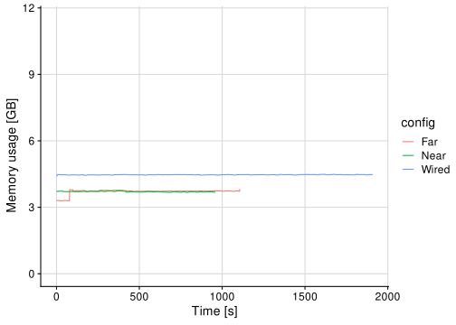<!-- -->

``` r
mem_data %>%
  ggplot(aes(x = mem_usage, y = config)) +
  geom_boxplot() +
  xlim(0, NA) +
  theme_half_open() +
  background_grid() +
  labs(x = "Memory usage [GB]    ", y = "Setup")
```

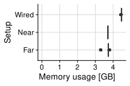<!-- -->
